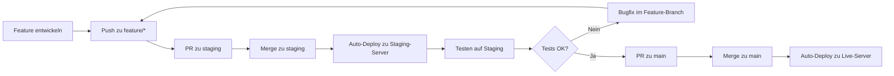

# Development Workflow & Branch Strategy

## 📋 Übersicht

Dieses Dokument beschreibt den professionellen Git-Workflow für das Risk Management System mit Feature-Branches, Staging- und Production-Umgebungen.

---

## 🌳 Branch-Struktur

```
feature/* → staging → main
```

### Branches

| Branch | Zweck | Deployed auf | Auto-Deploy |
|--------|-------|--------------|-------------|
| `main` | Production-Ready Code | Live-Server | ✅ Ja |
| `staging` | Test-Umgebung für Integration | Stage-Server | ✅ Ja |
| `feature/*` | Entwicklung neuer Features | Lokal | ❌ Nein |
| `bugfix/*` | Bugfixes | Lokal | ❌ Nein |
| `hotfix/*` | Kritische Fixes für Production | Lokal → main | ⚠️ Direkt |

---

## 🚀 Workflow

### 1. Neues Feature entwickeln

```bash
# Von staging branch starten
git checkout staging
git pull origin staging

# Feature-Branch erstellen
git checkout -b feature/mein-feature-name

# Entwickeln & committen
git add .
git commit -m "Feature: Beschreibung der Änderung"

# Pushen
git push origin feature/mein-feature-name
```

### 2. Pull Request zu Staging erstellen

**Auf GitHub:**
1. Gehe zu "Pull Requests" → "New Pull Request"
2. Base: `staging` ← Compare: `feature/mein-feature-name`
3. Beschreibung ausfüllen
4. "Create Pull Request"
5. Review (optional bei Solo-Projekten)
6. "Merge Pull Request"
7. Feature-Branch löschen (optional)

**Oder direkt mergen:**
```bash
git checkout staging
git merge feature/mein-feature-name
git push origin staging
```

### 3. Auf Staging-Server testen

- ✅ Funktionalität prüfen
- ✅ UI/UX testen
- ✅ Performance checken
- ✅ Browser-Kompatibilität
- ✅ Mobile-Ansicht testen

### 4. Nach erfolgreichem Test: Deploy zu Production

```bash
# Pull Request auf GitHub
# staging → main

# Oder direkt:
git checkout main
git pull origin main
git merge staging
git push origin main
```

### 5. Live-Server prüfen

- ✅ Deployment erfolgreich?
- ✅ Keine Fehler im Log?
- ✅ Funktionen arbeiten korrekt?

---

## 🔥 Hotfix-Workflow (Kritische Bugs auf Live)

```bash
# Von main branch starten
git checkout main
git pull origin main

# Hotfix-Branch erstellen
git checkout -b hotfix/kritischer-bug

# Fix entwickeln & committen
git add .
git commit -m "Hotfix: Kritischen Bug XYZ behoben"

# WICHTIG: In beide Branches mergen
# 1. Zu main (für sofortigen Fix)
git checkout main
git merge hotfix/kritischer-bug
git push origin main

# 2. Zu staging (damit nicht verloren geht)
git checkout staging
git merge hotfix/kritischer-bug
git push origin staging

# Hotfix-Branch löschen
git branch -d hotfix/kritischer-bug
git push origin --delete hotfix/kritischer-bug
```

---

## 📝 Naming Conventions

### Branch-Namen

```bash
# Features
feature/categories-api-integration
feature/alert-notification-system
feature/pdf-export

# Bugfixes
bugfix/event-marker-not-showing
bugfix/filter-reset-issue

# Hotfixes (kritisch)
hotfix/security-vulnerability
hotfix/database-connection-error

# Refactoring
refactor/cleanup-dashboard-code
refactor/optimize-queries
```

### Commit Messages

**Format:**
```
<type>: <kurze Beschreibung>

[optional: längere Beschreibung]
```

**Types:**
- `feat:` - Neues Feature
- `fix:` - Bugfix
- `refactor:` - Code-Umstrukturierung
- `docs:` - Dokumentation
- `style:` - Formatierung (keine Code-Änderung)
- `test:` - Tests hinzufügen
- `chore:` - Build-Prozess, Dependencies

**Beispiele:**
```bash
git commit -m "feat: Categories API integration für Infosystem"
git commit -m "fix: Event markers nicht sichtbar auf Karte"
git commit -m "refactor: Dashboard Code aufgeräumt und optimiert"
git commit -m "docs: README um Deployment-Anleitung erweitert"
```

---

## 🛠️ Setup: Staging-Umgebung einrichten

### Schritt 1: Staging Branch erstellen

```bash
# Staging Branch vom aktuellen main erstellen
git checkout main
git pull origin main
git checkout -b staging
git push -u origin staging
```

### Schritt 2: Staging-Server konfigurieren

**Option A: Separater Server**
- Domain: `staging.example.com`
- Git Clone & Checkout staging branch

**Option B: Subdirectory auf bestehendem Server**
```bash
# Auf dem Server
cd /var/www
git clone https://github.com/DHE-DEV/riskmanagementv2.git staging
cd staging
git checkout staging

# .env anpassen für staging
cp .env.example .env
# Staging-Datenbank konfigurieren
php artisan key:generate
composer install
php artisan migrate
```

### Schritt 3: Deployment-Hooks einrichten

Stelle sicher, dass dein Deployment-System (GitHub Actions, Webhook, etc.) zwei Branches überwacht:

- `main` → deployed nach `/var/www/production`
- `staging` → deployed nach `/var/www/staging`

---

## 🔒 GitHub Branch Protection Rules

### Für `main` Branch

**Settings → Branches → Branch protection rules → Add rule**

Branch name pattern: `main`

Aktivieren:
- ✅ Require a pull request before merging
- ✅ Require approvals (1)
- ✅ Dismiss stale pull request approvals when new commits are pushed
- ✅ Require status checks to pass before merging
- ✅ Require branches to be up to date before merging
- ✅ Include administrators (optional)

### Für `staging` Branch (optional, weniger strikt)

Branch name pattern: `staging`

Aktivieren:
- ✅ Require a pull request before merging (optional)
- Weniger Einschränkungen als main

---

## 📊 Typischer Entwicklungszyklus



---

## 🎯 Best Practices

### ✅ DO

- **Feature-Branches nutzen** für jede neue Funktionalität
- **Auf Staging testen** bevor zu main gemerged wird
- **Kleine, häufige Commits** statt große, seltene
- **Aussagekräftige Commit-Messages** schreiben
- **Pull Requests reviewen** (auch bei Solo-Projekten zur Dokumentation)
- **Nach jedem Deploy prüfen** ob alles funktioniert
- **Regelmäßig staging mit main synchronisieren** um Konflikte zu vermeiden

### ❌ DON'T

- **Nicht direkt auf main entwickeln** (außer Hotfixes)
- **Keine ungetesteten Features** nach main mergen
- **Keine "WIP" oder "Fix" Commits** ohne Beschreibung
- **Nicht mehrere unabhängige Features** in einem Branch
- **Keine sensiblen Daten** (Passwörter, Keys) committen
- **Nicht force-push** auf main oder staging

---

## 🔄 Maintenance Tasks

### Staging mit Main synchronisieren

```bash
# Staging auf Stand von main bringen
git checkout staging
git pull origin staging
git merge main
git push origin staging
```

### Feature-Branches aufräumen

```bash
# Lokal
git branch -d feature/altes-feature

# Remote
git push origin --delete feature/altes-feature

# Alle gelöschten Remote-Branches lokal aufräumen
git fetch --prune
```

### Merge-Konflikte lösen

```bash
git checkout staging
git merge feature/mein-feature

# Bei Konflikten:
# 1. Dateien öffnen und Konflikte manuell lösen
# 2. Änderungen stagen
git add .
git commit -m "Merge-Konflikt gelöst"
git push origin staging
```

---

## 📞 Support & Fragen

Bei Fragen zum Workflow:
1. Dieses Dokument konsultieren
2. Git-Dokumentation: https://git-scm.com/doc
3. GitHub Flow Guide: https://guides.github.com/introduction/flow/

---

## 🗓️ Changelog

| Datum | Version | Änderung |
|-------|---------|----------|
| 2025-10-15 | 1.0 | Initiales Dokument erstellt |

