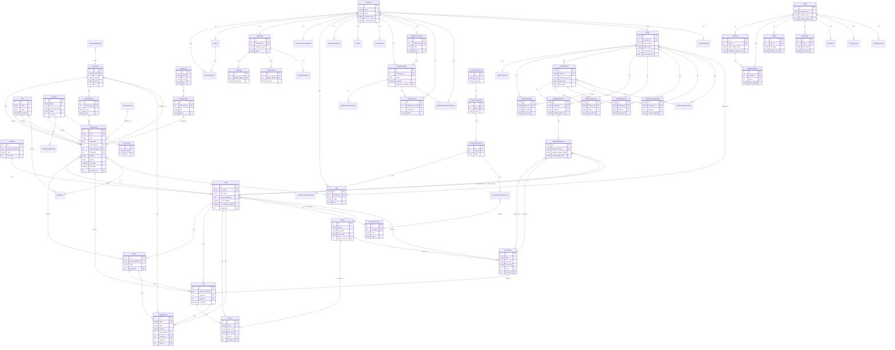

# ER-Diagramm - Risk Management v2

> Dieses Diagramm kann im [Mermaid Live Editor](https://mermaid.live) visualisiert werden.

```mermaid
erDiagram
    %% ============ GEO ============
    Continent ||--o{ Country : "has"
    Country ||--o{ Region : "has"
    Country ||--o{ City : "has"
    Country ||--o{ Airport : "has"
    Region ||--o{ City : "has"
    Region ||--o{ DisasterEvent : "has"
    City ||--o{ Airport : "has"
    City ||--o{ DisasterEvent : "has"
    Country ||--o{ DisasterEvent : "has"
    Country ||--o{ TourismCruisePort : "has"

    %% ============ AIRLINES / AIRPORTS ============
    Airline }o--o{ Airport : "operates_at"
    Airline }o--o{ AirportCode : "operates_at"
    Country ||--o{ Airline : "home_country"
    AirportCode }o--|| City : "located_in"
    AirportCode }o--|| Country : "located_in"

    %% ============ EVENTS ============
    EventType ||--o{ CustomEvent : "has"
    EventType ||--o{ EventCategory : "has"
    EventType ||--o{ DisasterEvent : "has"
    EventCategory ||--o{ CustomEvent : "has"
    CustomEvent }o--o{ Country : "affects"
    CustomEvent }o--o{ Region : "affects"
    CustomEvent }o--o{ City : "affects"
    CustomEvent }o--o{ EventType : "displayed_as"
    CustomEvent }o--o{ Label : "tagged_with"
    CustomEvent ||--o{ EventClick : "has"
    User ||--o{ CustomEvent : "created"
    User ||--o{ CustomEvent : "updated"
    User ||--o{ EventClick : "clicked"

    %% ============ API CLIENTS ============
    ApiClient ||--o{ CustomEvent : "created"
    ApiClient ||--o{ ApiClientRequestLog : "has"
    ApiClient }o--o{ EventGroup : "belongs_to"
    EventDisplaySetting }o--|| EventType : "uses"

    %% ============ INFO SOURCES ============
    InfoSource ||--o{ InfoSourceItem : "has"
    InfoSourceItem }o--o| CustomEvent : "imported_as"
    InfosystemEntry }o--o| CustomEvent : "published_as"

    %% ============ CUSTOMERS ============
    Customer ||--o{ BookingLocation : "has"
    Customer ||--o{ Branch : "has"
    Customer ||--o| PluginClient : "has"
    Customer ||--o| CustomerFeatureOverride : "has"
    Customer ||--o{ Label : "owns"
    Customer ||--o{ GtmApiRequestLog : "has"
    Customer ||--o{ SsoLog : "has"
    Customer ||--o{ BranchExport : "has"
    Branch ||--o| BookingLocation : "has"

    %% ============ NOTIFICATIONS ============
    Customer ||--o{ NotificationRule : "has"
    Customer ||--o{ NotificationTemplate : "has"
    Customer ||--o{ NotificationLog : "has"
    NotificationRule ||--o{ NotificationRuleRecipient : "has"
    NotificationRule ||--o{ NotificationLog : "has"
    NotificationTemplate ||--o{ NotificationRule : "uses"
    Customer ||--o{ NotificationUnsubscribeToken : "has"
    NotificationRule ||--o{ NotificationUnsubscribeToken : "has"

    %% ============ PLUGIN ============
    PluginClient ||--o{ PluginKey : "has"
    PluginClient ||--o{ PluginDomain : "has"
    PluginClient ||--o{ PluginUsageEvent : "has"

    %% ============ FOLDERS (Reisedossiers) ============
    Customer ||--o{ Folder : "owns"
    Folder ||--o| FolderCustomer : "has"
    Folder ||--o{ FolderParticipant : "has"
    Folder ||--o{ FolderItinerary : "has"
    Folder ||--o{ FolderFlightService : "has"
    Folder ||--o{ FolderHotelService : "has"
    Folder ||--o{ FolderShipService : "has"
    Folder ||--o{ FolderCarRentalService : "has"
    Folder ||--o{ FolderTimelineLocation : "has"
    Folder }o--o{ Label : "tagged_with"
    FolderItinerary ||--o{ FolderFlightService : "has"
    FolderItinerary ||--o{ FolderHotelService : "has"
    FolderItinerary ||--o{ FolderShipService : "has"
    FolderItinerary ||--o{ FolderCarRentalService : "has"
    FolderItinerary ||--o{ FolderTimelineLocation : "has"
    FolderItinerary }o--o{ FolderParticipant : "includes"
    FolderFlightService ||--o{ FolderFlightSegment : "has"
    FolderFlightSegment }o--|| AirportCode : "departs_from"
    FolderFlightSegment }o--|| AirportCode : "arrives_at"
    FolderFlightSegment }o--|| Country : "departs_country"
    FolderFlightSegment }o--|| Country : "arrives_country"
    Customer ||--o{ FolderImportLog : "has"

    %% ============ TRAVEL DETAIL (PDS) ============
    TdTrip ||--o{ TdAirLeg : "has"
    TdTrip ||--o{ TdFlightSegment : "has"
    TdTrip ||--o{ TdStay : "has"
    TdTrip ||--o{ TdTraveller : "has"
    TdTrip ||--o{ TdTransfer : "has"
    TdTrip ||--o{ TdTripLocation : "has"
    TdTrip ||--o{ TdPdsShareLink : "has"
    TdAirLeg ||--o{ TdFlightSegment : "has"

    %% ============ CRUISE ============
    TourismCruiseLine ||--o{ TourismCruiseShip : "has"
    TourismCruiseShip ||--o{ TourismCruiseRoute : "has"
    TourismCruiseRoute ||--o{ TourismCruiseRouteCruise : "has"
    TourismCruiseRoute ||--o{ TourismCruiseRouteCourse : "has"
    TourismCruiseRouteCourse }o--|| TourismCruisePort : "stops_at"

    %% ============ ENTITY ATTRIBUTES ============
    Continent {
        int id PK
        json name_translations
        string code
        int sort_order
    }
    Country {
        int id PK
        string iso_code UK
        string iso3_code
        json name_translations
        boolean is_eu_member
        boolean is_schengen_member
        int continent_id FK
    }
    Region {
        int id PK
        json name_translations
        string code
        int country_id FK
    }
    City {
        int id PK
        json name_translations
        int country_id FK
        int region_id FK
        boolean is_capital
    }
    Airport {
        int id PK
        string name
        string iata_code
        string icao_code
        int city_id FK
        int country_id FK
    }
    Airline {
        int id PK
        string name
        string iata_code
        string icao_code
        int home_country_id FK
    }
    AirportCode {
        int id PK
        string ident
        string iata_code
        string icao_code
        int city_id FK
        int country_id FK
    }
    EventType {
        int id PK
        string code UK
        string name
        string color
        string icon
    }
    EventCategory {
        int id PK
        int event_type_id FK
        string name
        string color
    }
    CustomEvent {
        int id PK
        string uuid UK
        string title
        text description
        int event_type_id FK
        int event_category_id FK
        int country_id FK
        string severity
        string priority
        datetime start_date
        datetime end_date
        int api_client_id FK
    }
    DisasterEvent {
        int id PK
        string uuid UK
        string title
        string severity
        int event_type_id FK
        int country_id FK
        int region_id FK
        int city_id FK
    }
    User {
        int id PK
        string name
        string email UK
        boolean is_admin
    }
    Customer {
        int id PK
        string name
        string email UK
        string customer_type
        string company_name
    }
    ApiClient {
        int id PK
        string name
        string company_name
        string status
        int rate_limit
    }
    EventGroup {
        int id PK
        string name
        string slug UK
    }
    Label {
        string id PK
        int customer_id FK
        string name
        string color
    }
    NotificationRule {
        int id PK
        int customer_id FK
        string name
        boolean is_active
        int notification_template_id FK
    }
    NotificationTemplate {
        int id PK
        int customer_id FK
        string name
        string subject
    }
    NotificationLog {
        int id PK
        int notification_rule_id FK
        int customer_id FK
        string status
    }
    PluginClient {
        int id PK
        int customer_id FK
        string company_name
        string status
    }
    PluginKey {
        int id PK
        int plugin_client_id FK
        string public_key
    }
    PluginDomain {
        int id PK
        int plugin_client_id FK
        string domain
    }
    Folder {
        string id PK
        int customer_id FK
        string folder_number
        string folder_name
        date travel_start_date
        date travel_end_date
    }
    FolderItinerary {
        string id PK
        string folder_id FK
        string booking_reference
        date start_date
        date end_date
    }
    FolderParticipant {
        string id PK
        string folder_id FK
        string first_name
        string last_name
    }
    FolderFlightService {
        string id PK
        string itinerary_id FK
        string folder_id FK
        string booking_reference
    }
    FolderFlightSegment {
        string id PK
        string flight_service_id FK
        string departure_airport_code
        string arrival_airport_code
    }
    FolderHotelService {
        string id PK
        string itinerary_id FK
        string folder_id FK
        string hotel_name
    }
    FolderShipService {
        string id PK
        string itinerary_id FK
        string folder_id FK
        string ship_name
    }
    FolderCarRentalService {
        string id PK
        string itinerary_id FK
        string folder_id FK
        string rental_company
    }
    TdTrip {
        int id PK
        string external_trip_id
        string provider_name
        string booking_reference
    }
    TdAirLeg {
        int id PK
        int trip_id FK
        string origin_airport_code
        string destination_airport_code
    }
    TdFlightSegment {
        int id PK
        int air_leg_id FK
        int trip_id FK
        string flight_number
    }
    TdStay {
        int id PK
        int trip_id FK
        string stay_type
        string location_name
    }
    TdTraveller {
        int id PK
        int trip_id FK
        string first_name
        string last_name
    }
    TourismCruiseLine {
        int id PK
        string code
        string name
    }
    TourismCruiseShip {
        int id PK
        int line_id FK
        string name
    }
    TourismCruiseRoute {
        int id PK
        int ship_id FK
        string name
    }
    TourismCruisePort {
        int id PK
        int country_id FK
        string code
        string name
    }
    InfoSource {
        int id PK
        string name
        string code
        string type
    }
    InfoSourceItem {
        int id PK
        int info_source_id FK
        string title
        string status
    }
```
