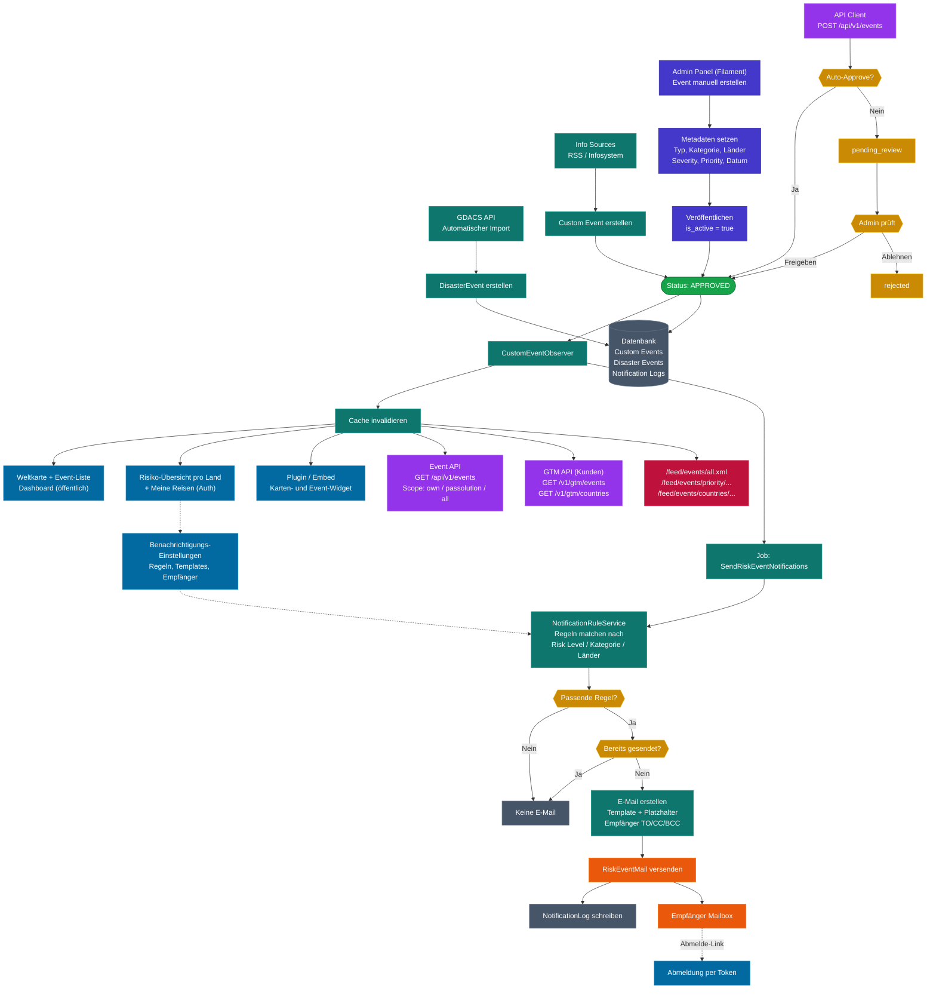

# Flowchart - Risk Management System

> Dieses Diagramm kann im [Mermaid Live Editor](https://mermaid.live) visualisiert werden.

```mermaid
flowchart TD
    classDef admin fill:#4338ca,color:#fff,stroke:#3730a3
    classDef system fill:#0f766e,color:#fff,stroke:#0d9488
    classDef customer fill:#0369a1,color:#fff,stroke:#0284c7
    classDef api fill:#9333ea,color:#fff,stroke:#a855f7
    classDef output fill:#ea580c,color:#fff,stroke:#f97316
    classDef data fill:#475569,color:#fff,stroke:#64748b
    classDef decision fill:#ca8a04,color:#fff,stroke:#eab308
    classDef feed fill:#be123c,color:#fff,stroke:#e11d48
    classDef approved fill:#16a34a,color:#fff,stroke:#15803d

    %% === EINGABE ===
    ADMIN["Admin Panel (Filament)\nEvent manuell erstellen"]:::admin
    GDACS["GDACS API\nAutomatischer Import"]:::system
    APICLIENT["API Client\nPOST /api/v1/events"]:::api
    INFOSOURCE["Info Sources\nRSS / Infosystem"]:::system

    %% === ADMIN FLOW ===
    ADMIN --> META["Metadaten setzen\nTyp, Kategorie, Länder\nSeverity, Priority, Datum"]:::admin
    META --> PUBLISH["Veröffentlichen\nis_active = true"]:::admin
    PUBLISH --> APPROVED

    %% === AUTO IMPORT ===
    GDACS --> DISASTER["DisasterEvent erstellen"]:::system
    INFOSOURCE --> AUTOEVENT["Custom Event erstellen"]:::system
    AUTOEVENT --> APPROVED

    %% === API FLOW ===
    APICLIENT --> AUTOCHECK{{"Auto-Approve?"}}:::decision
    AUTOCHECK -->|Ja| APPROVED
    AUTOCHECK -->|Nein| PENDING["pending_review"]:::decision
    PENDING --> REVIEW{{"Admin prüft"}}:::decision
    REVIEW -->|Freigeben| APPROVED
    REVIEW -->|Ablehnen| REJECTED["rejected"]:::decision

    %% === APPROVED = ZENTRALER KNOTEN ===
    APPROVED(["Status: APPROVED"]):::approved

    %% === VERARBEITUNG ===
    APPROVED --> OBSERVER["CustomEventObserver"]:::system
    OBSERVER --> CACHE["Cache invalidieren"]:::system
    OBSERVER --> JOB["Job: SendRiskEventNotifications"]:::system

    %% === BENACHRICHTIGUNG ===
    JOB --> MATCH["NotificationRuleService\nRegeln matchen nach\nRisk Level / Kategorie / Länder"]:::system
    MATCH --> FOUND{{"Passende Regel?"}}:::decision
    FOUND -->|Nein| STOP["Keine E-Mail"]:::data
    FOUND -->|Ja| DUPECHECK{{"Bereits gesendet?"}}:::decision
    DUPECHECK -->|Ja| STOP
    DUPECHECK -->|Nein| BUILDMAIL["E-Mail erstellen\nTemplate + Platzhalter\nEmpfänger TO/CC/BCC"]:::system
    BUILDMAIL --> SENDMAIL["RiskEventMail versenden"]:::output
    SENDMAIL --> LOGMAIL["NotificationLog schreiben"]:::data
    SENDMAIL --> MAILBOX["Empfänger Mailbox"]:::output
    MAILBOX -.->|Abmelde-Link| UNSUB["Abmeldung per Token"]:::customer

    %% === AUSGABE: KUNDEN ===
    CACHE --> DASH["Weltkarte + Event-Liste\nDashboard (öffentlich)"]:::customer
    CACHE --> RISK["Risiko-Übersicht pro Land\n+ Meine Reisen (Auth)"]:::customer
    CACHE --> EMBED["Plugin / Embed\nKarten- und Event-Widget"]:::customer

    %% === AUSGABE: API ===
    CACHE --> EVENTAPI["Event API\nGET /api/v1/events\nScope: own / passolution / all"]:::api
    CACHE --> GTMAPI["GTM API (Kunden)\nGET /v1/gtm/events\nGET /v1/gtm/countries"]:::api
    CACHE --> FEEDS["/feed/events/all.xml\n/feed/events/priority/...\n/feed/events/countries/..."]:::feed

    %% === KUNDEN SELF-SERVICE ===
    RISK -.-> SETTINGS["Benachrichtigungs-Einstellungen\nRegeln, Templates, Empfänger"]:::customer
    SETTINGS -.-> MATCH

    %% === DATENBANK ===
    APPROVED --> DB[("Datenbank\nCustom Events\nDisaster Events\nNotification Logs")]:::data
    DISASTER --> DB
```
