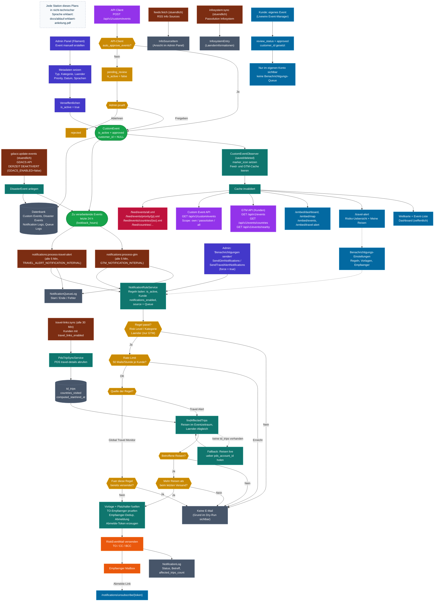

# Flowchart - Risk Management System

> Dieses Diagramm kann im [Mermaid Live Editor](https://mermaid.live) visualisiert werden.
>
> **Begleitende Erklaerung:** Jede Station dieses Plans ist in
> [ablauf-erklaert-anleitung.pdf](ablauf-erklaert-anleitung.pdf) in nicht-technischer
> Sprache beschrieben – gedacht fuer Kolleginnen und Kollegen ohne technischen Hintergrund.
>
> Stand: 11.08.2026

## Wichtige Punkte

**Benachrichtigungen laufen nicht mehr ueber den Observer.**
`CustomEventObserver` setzt nur noch `marker_icon` und leert die Feed-/GTM-Caches.
Der Versand liegt bei zwei getrennten Cron-Queues:

| Befehl | Quelle (`source`) | Intervall |
|---|---|---|
| `notifications:process-gtm` | `global_travel_monitor` | `GTM_NOTIFICATION_INTERVAL` (Standard 5 Min) |
| `notifications:process-travel-alert` | `travel_alert` | `TRAVEL_ALERT_NOTIFICATION_INTERVAL` (Standard 5 Min) |
| `travel-links:sync` | Reisedaten fuer Travel Alert | `notifications.travel_links_sync_interval` (Standard 30 Min) |

Jeder Lauf betrachtet Events der letzten `NOTIFICATION_LOOKBACK_HOURS` Stunden (Standard 24)
und schreibt einen `NotificationQueueLog`-Eintrag.

**Beruecksichtigte Events je Lauf**
- `CustomEvent`: `is_active = true`, `review_status = approved`, `customer_id IS NULL`
- `DisasterEvent`: alle im Lookback-Zeitraum
- Kundeneigene Events (`customer_id` gesetzt) werden bewusst nicht versendet.

**Unterschied der beiden Quellen**
- *GTM*: Laenderfilter der Regel greift, Duplikatpruefung ueber `NotificationLog`.
- *Travel Alert*: Laenderfilter der Regel greift nicht; stattdessen Abgleich der
  Event-Laender mit `countries_visited` der Reisen. Ohne betroffene Reise keine Mail.
  Erneuter Versand nur, wenn mehr Reisen betroffen sind als beim letzten Mal.
  Liegen lokal keine `td_trips` vor, werden die Reisen live ueber die
  `pds_account_id` des Kunden bei PDS geholt.

**GDACS ist derzeit abgeschaltet.** `GDACS_ENABLED=false` – die stuendliche Einplanung in
`routes/console.php:12` greift damit nicht, es entstehen keine neuen `DisasterEvent`-Saetze.
Bereits vorhandene bleiben erhalten und werden weiter mitverarbeitet.

**Info-Quellen erzeugen keine Events.** `feeds:fetch` legt `InfoSourceItem` an,
`infosystem:sync` legt `InfosystemEntry` an – beides reine Ablage fuer das Admin Panel.

**Diagnose**
- `notifications:process-gtm --dry-run` / `notifications:process-travel-alert --dry-run`
  zeigen je Regel, wer eine Mail bekaeme bzw. woran es scheitert.
- `notifications:rules` listet die hinterlegten Regeln.
